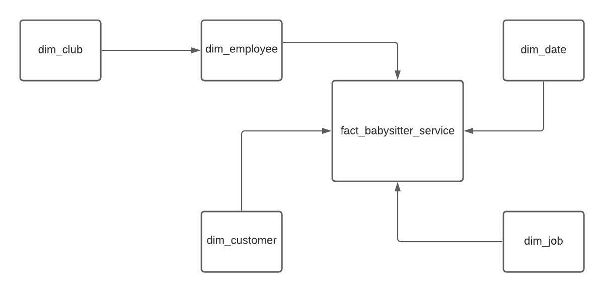
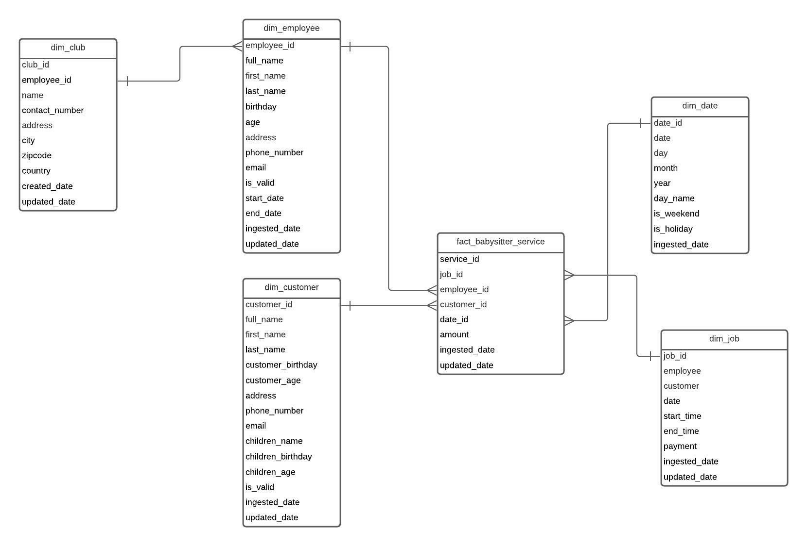

# Babysitter Club

## **Exercise description**
The Business Association is conducting a babysitter services as a fundraiser for different clubs in the college. When a customer is entered into the system, the Club coordinator gets name, address, and phone. The coordinator also records each babysitting job, the amount paid for it and the sitter assigned to the job. Each person may sign up to credit only one club and the system keeps the contact persion and phone number for each participating club.

The treasurer wants a data warehouse for this. He would like to be able to determine how much each customer was billed by week, month or year. How much each employee earned, also summed by time periods. He is interested in how much work is done on weekends, holidats or other special days. Develop a data warehouse to provide this information.

The transaction ER diagram is below.

## **Business process overview**
The business process represented in this exercise is related with operational data generated ever each babysitter service is created.

## **Granularity**
The business wants a data warehouse which allows to extract information about:

    - How much each customer was billed by week, month or year;
    - How much each employee earned in different time periods;
    - How much work is done on different time periods.

## **Grain**
Each row of the fact table represents a babysitter job, which has information about customer, employee and amount of money spent, during the time.

## **Dimensions**
These are the proposed dimensions that can be created:

    - dim_employee: contains information about the employee and their main attributes;
    - dim_club: contains information about the club;
    - dim_customer: contains information about the customer and their main attributes;
    - dim_date: contains information about date and time;
    - dim_job: contains information about each babysitter job.

## **Facts**
The metric of the fact table is non-addictive measure, representing the amount of money associated to each babysitter job. The information about the metric is extracted from job dimension, that has detailed information about that.

## **Conceptual Model**

## **Logical Model**
