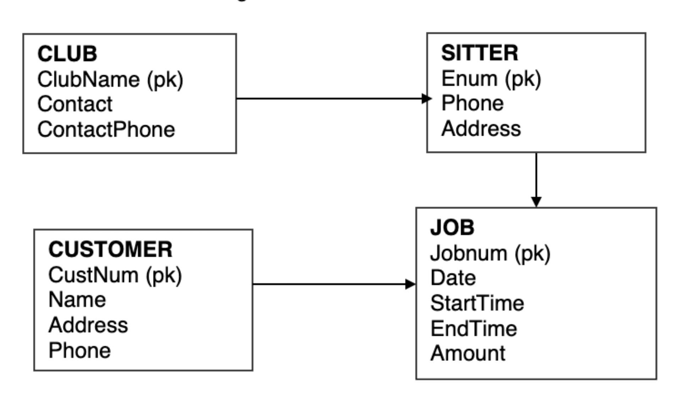

# Babysitter Club 

## **Exercise description**
The Business Association is conducting a babysitter services as a fundraiser for different clubs in the college. When a customer is entered into the system, the Club coordinator gets name, address, and phone. The coordinator also records each babysitting job, the amount paid for it and the sitter assigned to the job. Each person may sign up to credit only one club and the system keeps the contact persion and phone number for each participating club.

The treasurer wants a data warehouse for this. He would like to be able to determine how much each customer was billed by week, month or year. How much each employee earned, also summed by time periods. He is interested in how much work is done on weekends, holidats or other special days. Develop a data warehouse to provide this information.

The transaction ER diagram is below.

## **Business process overview**

## **Granularity**

## **Dimensions**

## **Facts**