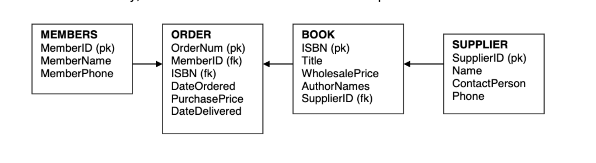

# Bookstore

## **Exercise description**
The DPMA Club at XU operates a small bookstore for professional books. The club orders a selection of books for display and records them in a catalog. When members order a book, they pay for it and their name and the books they ordered are added to the order list. When the book arrives, the member is notified to pick up the book. The club wants to track member activity, including amount spent, cost of books, time for delivery.

The transaction ER diagram is below.

## **Business process overview**

## **Granularity**

## **Grain**

## **Dimensions**

## **Facts**

## **Conceptual Model**

## **Logical Model**
