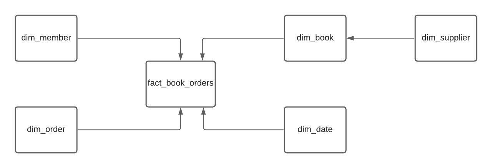
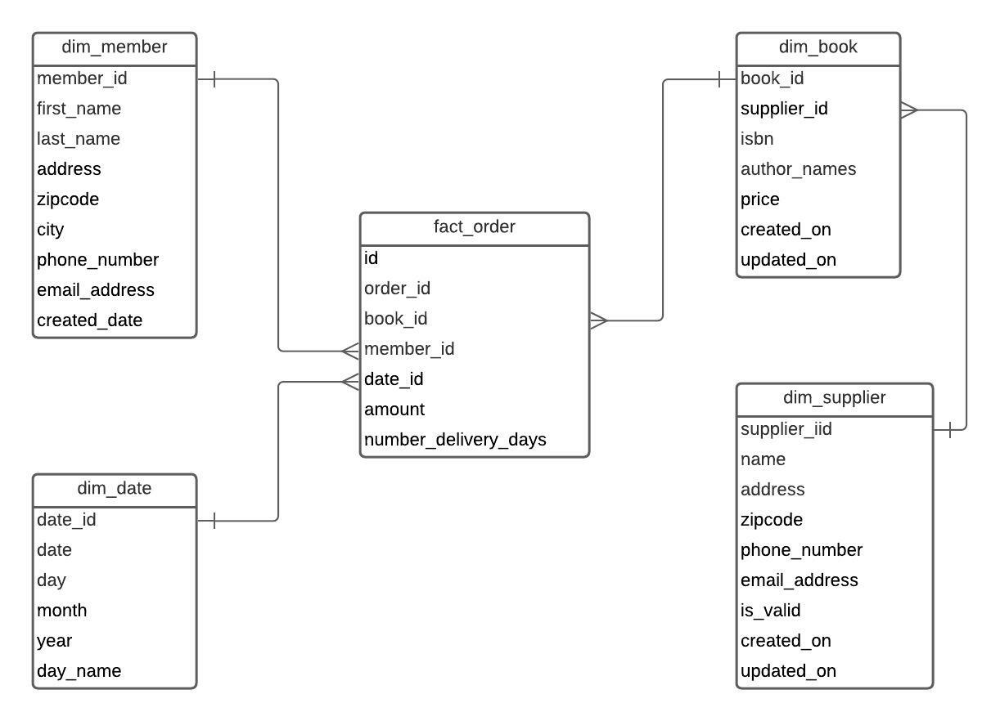

# Bookstore

## **Exercise description**
The DPMA Club at XU operates a small bookstore for professional books. The club orders a selection of books for display and records them in a catalog. When members order a book, they pay for it and their name and the books they ordered are added to the order list. When the book arrives, the member is notified to pick up the book. The club wants to track member activity, including amount spent, cost of books, time for delivery.

The transaction ER diagram is below.

## **Business process overview**
The business process represented in this exercise is related with bookstore business, i.e., buy and sell books.

## **Granularity**
The business wants a data warehouse which allows to extract information about:

- Amount of money spent by each member;
- The delivery time of each order.

## **Grain**
Each row of the fact table represents a book order, which has information about member, book, supplier, amount of money spent, and the number of days for delivery.

## **Dimensions**
These are the proposed dimensions that can be created:

- dim_member: contains information about the member and their main attributes;
- dim_book: contains information about book and their attributes;
- dim_supplier: contains information about book supplier and their main attributes;
- dim_date: contains information about data and time.

## **Facts**
The metric of the fact table is an addictive measure, representing the amount of money spent by each order made by a member. The amount of money spent in each order is the sum of the purchase price of each book.

## **Conceptual Model**

## **Logical Model**

