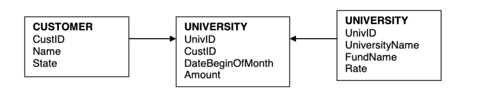
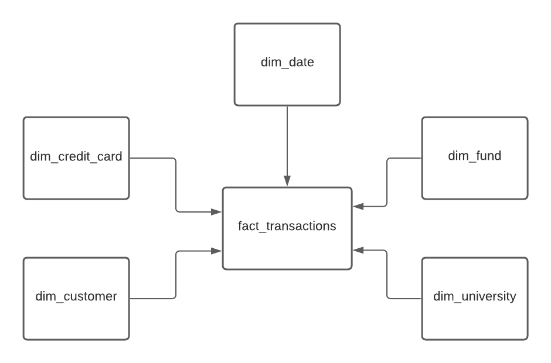
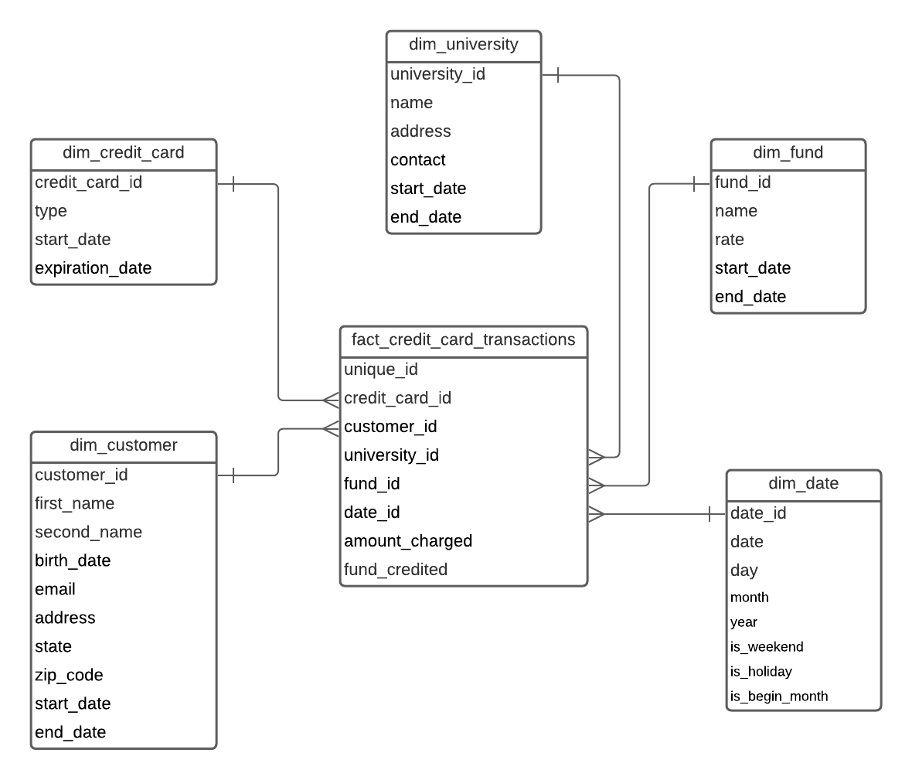

# Consumer Credit Cards

## **Exercise description**
Consumer Cards provides affiliate credit cards for Universities. Graduates or other people wje would like to support a particular university get a credit card with the university logo on it. Customers can have one or more cards at a time. The card company totals the amount charged on each card each month and pays the specified University fund a percent of that amount determined by the rate negotiated. Consumer Cards wants a data warehouse to track the results of this process over time, including customer, the state where the customer lived at the time, the charge was credited, and the fund credited at the time.

## **Business process overview**
The business process represented in this exercise is related with credit carts for Universities.

## **Granularity**
The business wants a data warehouse to track:

- The total of amount charged on each card by month;
- The total of pays made by each university fund.

## **Grain**
Each row of the fact table represents the amount of money and fund credited by each customer.

## **Dimensions**
These are the proposed dimensions that can be created:

- dim_customer: contains information about customer and their attributes;
- dim_credit_card: contains information about credit card;
- dim_fund: contains information about fund;
- dim_university: contains information about university and their attributes;
- dim_date: contains information about data and time.

## **Facts**
The metric of the fact table is an addictive measure, representing the total of money charged in each credit card, by each customer. The total of payments that each university funds.

## **Conceptual Model**

## **Logical Model**
